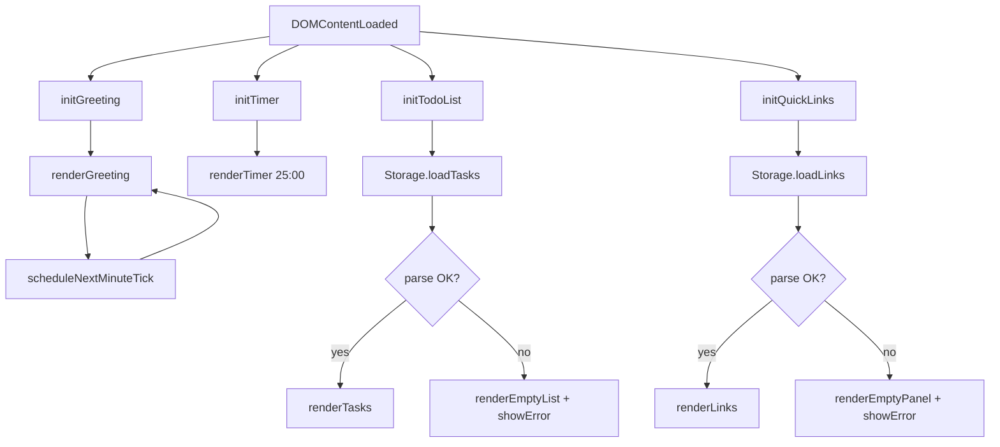
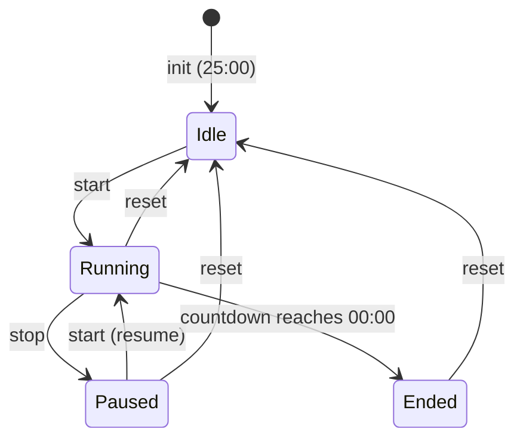

# Design Document

## Overview

The To-Do Life Dashboard is a single-page, client-side productivity application built exclusively with HTML, CSS, and Vanilla JavaScript. It runs entirely in the browser with no build step, no framework, and no backend — all persistent state lives in `localStorage`.

The page is divided into four self-contained widget sections arranged in a responsive grid:

1. **Greeting & Live Clock** — displays current time, date, and a time-of-day greeting
2. **Focus Timer** — a Pomodoro-style 25-minute countdown with start/pause/reset
3. **To-Do List** — full CRUD task management with localStorage persistence
4. **Quick Links** — user-defined shortcut buttons that open URLs in a new tab

Because the entire application is a single HTML file with one CSS file and one JS file, there is no module bundler, no transpilation, and no network dependency at runtime.

---

## Architecture

The application follows a **widget-based MVC-lite pattern** entirely within a single JavaScript file. Each widget owns its own state, DOM references, and event handlers. A shared `Storage` utility wraps `localStorage` with error handling. There is no global framework — widgets communicate only through direct function calls or DOM events.

```
index.html
├── css/
│   └── style.css          (single stylesheet, no @import)
└── js/
    └── app.js             (single script, no modules)
```

### Execution Flow



### Module Boundaries (within app.js)

Each widget is implemented as an IIFE-style block or a plain object with `init()` and helper functions. The four top-level namespaces are:

| Namespace | Responsibility |
|---|---|
| `GreetingWidget` | Clock, date, greeting text, minute-tick scheduling |
| `TimerWidget` | Countdown state machine, interval management, UI updates |
| `TodoWidget` | Task CRUD, edit-mode state, validation, Storage sync |
| `QuickLinksWidget` | Link CRUD, validation, Storage sync |
| `Storage` | `localStorage` read/write with try/catch, JSON parse/stringify |

---

## Components and Interfaces

### Storage Utility

```js
Storage = {
  // Returns parsed value or null on error
  load(key: string): any | null,

  // Returns true on success, false on failure
  save(key: string, value: any): boolean,
}
```

Storage keys:
- `"tdld_tasks"` — JSON array of Task objects
- `"tdld_links"` — JSON array of Link objects

### GreetingWidget

```js
GreetingWidget = {
  init(): void,           // called once on DOMContentLoaded
  render(): void,         // updates DOM with current time/date/greeting
  getGreeting(hour: number): string,  // pure function: hour → greeting string
  formatTime(date: Date): string,     // pure function: Date → "HH:MM"
  formatDate(date: Date): string,     // pure function: Date → "Weekday, DD Month YYYY"
  scheduleNextTick(): void,           // sets timeout to next minute boundary
}
```

### TimerWidget

Timer state machine:



```js
TimerWidget = {
  init(): void,
  start(): void,
  stop(): void,
  reset(): void,
  tick(): void,           // called every second by setInterval
  render(): void,         // updates MM:SS display and button states
  formatTime(seconds: number): string,  // pure: seconds → "MM:SS"
}

// Internal state
timerState: { status: 'idle'|'running'|'paused'|'ended', remaining: number }
```

### TodoWidget

```js
TodoWidget = {
  init(): void,
  addTask(title: string): void,
  editTask(id: string, newTitle: string): void,
  deleteTask(id: string): void,
  toggleComplete(id: string): void,
  enterEditMode(id: string): void,
  exitEditMode(cancelAll: boolean): void,
  renderList(): void,
  renderTask(task: Task): HTMLElement,
  validateTitle(title: string): string | null,  // null = valid, string = error message
  persistTasks(): boolean,
}
```

### QuickLinksWidget

```js
QuickLinksWidget = {
  init(): void,
  addLink(label: string, url: string): void,
  deleteLink(id: string): void,
  renderPanel(): void,
  renderLink(link: Link): HTMLElement,
  validateLink(label: string, url: string): string | null,
  persistLinks(): boolean,
}
```

---

## Data Models

### Task

```js
{
  id: string,          // crypto.randomUUID() or Date.now().toString()
  title: string,       // 1–250 characters, trimmed
  completed: boolean,
  createdAt: number,   // Unix timestamp ms
}
```

### Link

```js
{
  id: string,          // crypto.randomUUID() or Date.now().toString()
  label: string,       // 1–100 characters, trimmed
  url: string,         // 1–2048 characters, must start with http:// or https://
  createdAt: number,   // Unix timestamp ms
}
```

### localStorage Schema

```
localStorage["tdld_tasks"] = JSON.stringify(Task[])
localStorage["tdld_links"] = JSON.stringify(Link[])
```

Both keys are absent on first load; the widgets treat absence the same as an empty array.

---

## Correctness Properties

*A property is a characteristic or behavior that should hold true across all valid executions of a system — essentially, a formal statement about what the system should do. Properties serve as the bridge between human-readable specifications and machine-verifiable correctness guarantees.*

---

### Property 1: Time formatting is always valid HH:MM

*For any* `Date` object, `GreetingWidget.formatTime(date)` SHALL return a string matching the pattern `HH:MM` where HH is in [00, 23] and MM is in [00, 59].

**Validates: Requirements 1.1**

---

### Property 2: Date formatting matches the required pattern

*For any* `Date` object, `GreetingWidget.formatDate(date)` SHALL return a string in the format `"Weekday, DD Month YYYY"` where Weekday is a valid English day name, DD is the correct zero-padded day, Month is the correct English month name, and YYYY is the four-digit year.

**Validates: Requirements 1.2**

---

### Property 3: Greeting is determined by hour

*For any* integer hour in [0, 23], `GreetingWidget.getGreeting(hour)` SHALL return exactly one of `"Good Morning"`, `"Good Afternoon"`, `"Good Evening"`, or `"Good Night"` according to the time-of-day ranges defined in the requirements — and the mapping is exhaustive (every hour maps to exactly one greeting).

**Validates: Requirements 1.3, 1.4, 1.5, 1.6**

---

### Property 4: Timer time formatting is always valid MM:SS

*For any* integer number of seconds in [0, 1500], `TimerWidget.formatTime(seconds)` SHALL return a string matching the pattern `MM:SS` where MM is in [00, 25] and SS is in [00, 59], and the numeric value equals the input seconds.

**Validates: Requirements 2.8**

---

### Property 5: Timer stop preserves remaining time

*For any* running timer with any remaining time in [1, 1500] seconds, calling `stop()` SHALL transition the timer to `paused` state and leave `remaining` unchanged.

**Validates: Requirements 2.5**

---

### Property 6: Timer reset always returns to initial state

*For any* timer state (`running`, `paused`, or `ended`) with any remaining time, calling `reset()` SHALL set `remaining` to 1500 (25:00) and `status` to `'idle'`, regardless of the prior state.

**Validates: Requirements 2.6**

---

### Property 7: Timer resume preserves remaining time

*For any* paused timer with any remaining time in [1, 1499] seconds, calling `start()` SHALL transition the timer to `running` state with the same `remaining` value (i.e., no time is lost on resume).

**Validates: Requirements 2.3**

---

### Property 8: Task addition round-trip

*For any* valid task title (non-empty, non-whitespace-only, ≤ 250 characters), calling `TodoWidget.addTask(title)` SHALL result in: (a) the task appearing in the rendered list, and (b) `Storage.load("tdld_tasks")` returning an array that contains a task with the same trimmed title.

**Validates: Requirements 3.2, 6.1**

---

### Property 9: Whitespace-only task titles are always rejected

*For any* string composed entirely of whitespace characters (spaces, tabs, newlines) or the empty string, calling `TodoWidget.addTask(title)` SHALL not add any task to the list and SHALL display a validation error message.

**Validates: Requirements 3.3**

---

### Property 10: Task rendering always includes all required controls

*For any* `Task` object, `TodoWidget.renderTask(task)` SHALL return a DOM element that contains: the task title text, a completion toggle, an edit control, and a delete control.

**Validates: Requirements 3.5**

---

### Property 11: Task edit round-trip

*For any* existing task and any valid new title (non-empty, non-whitespace-only, ≤ 250 characters), calling `TodoWidget.editTask(id, newTitle)` SHALL update the task's displayed title to the trimmed new title AND persist the updated task collection to Storage so that `Storage.load("tdld_tasks")` reflects the new title.

**Validates: Requirements 4.2, 6.2**

---

### Property 12: Whitespace-only edit titles are always rejected

*For any* existing task and any whitespace-only or empty string as the new title, calling `TodoWidget.editTask(id, whitespaceTitle)` SHALL leave the task's title unchanged in both the UI and Storage.

**Validates: Requirements 4.3**

---

### Property 13: Edit mode pre-fills with current title

*For any* `Task` object in the list, calling `TodoWidget.enterEditMode(id)` SHALL replace the title display with an `<input>` element whose value equals the task's current title.

**Validates: Requirements 4.1**

---

### Property 14: Completion toggle is a round-trip

*For any* task with any completion state, calling `TodoWidget.toggleComplete(id)` twice SHALL return the task to its original completion state, and the rendered list SHALL reflect the correct strikethrough styling at each intermediate state.

**Validates: Requirements 5.1, 5.2, 5.3**

---

### Property 15: Task deletion round-trip

*For any* task list containing at least one task, calling `TodoWidget.deleteTask(id)` SHALL remove the task from the rendered list AND from `Storage.load("tdld_tasks")`, so that neither the UI nor a subsequent page load shows the deleted task.

**Validates: Requirements 5.4, 6.3**

---

### Property 16: Task persistence load round-trip

*For any* array of valid `Task` objects stored in `localStorage["tdld_tasks"]`, calling `TodoWidget.init()` SHALL render exactly those tasks (same count, same titles, same completion states) in the list.

**Validates: Requirements 3.6, 6.4**

---

### Property 17: Link addition round-trip

*For any* valid label (non-empty, ≤ 100 chars) and valid URL (non-empty, starts with `http://` or `https://`, ≤ 2048 chars), when the current link count is below 50, calling `QuickLinksWidget.addLink(label, url)` SHALL result in: (a) the link appearing as a clickable button in the panel, and (b) `Storage.load("tdld_links")` containing a link with the same label and URL.

**Validates: Requirements 7.2, 9.1**

---

### Property 18: Invalid link submissions are always rejected

*For any* combination of inputs where at least one of the following is true — label is empty, URL is empty, URL does not start with `http://` or `https://`, or the current link count is ≥ 50 — calling `QuickLinksWidget.addLink(label, url)` SHALL not add any link to the panel and SHALL display a validation error message identifying the cause.

**Validates: Requirements 7.3**

---

### Property 19: Link rendering always includes a delete control

*For any* `Link` object, `QuickLinksWidget.renderLink(link)` SHALL return a DOM element that contains a clickable button with the link's label and a delete control.

**Validates: Requirements 8.1**

---

### Property 20: Link deletion round-trip

*For any* link panel containing at least one link, calling `QuickLinksWidget.deleteLink(id)` SHALL remove the link from the rendered panel AND from `Storage.load("tdld_links")`, so that neither the UI nor a subsequent page load shows the deleted link.

**Validates: Requirements 8.2, 8.3, 9.2**

---

### Property 21: Link persistence load round-trip

*For any* array of valid `Link` objects stored in `localStorage["tdld_links"]`, calling `QuickLinksWidget.init()` SHALL render exactly those links (same count, same labels, same URLs) in the panel.

**Validates: Requirements 7.5, 9.3**

---

## Error Handling

### Storage Failures

All `localStorage` operations are wrapped in `try/catch`. The `Storage` utility returns `null` on read failure and `false` on write failure. Each widget checks the return value and responds as follows:

| Operation | Storage failure response |
|---|---|
| Load tasks on init | Render empty list + show inline error |
| Load links on init | Render empty panel + show inline error |
| Save after add/edit/toggle | Retain UI state + show inline error |
| Save after delete | Restore deleted item to UI + show inline error |

Inline error messages are rendered as `<p role="alert" class="error-msg">` elements adjacent to the affected widget. They are cleared on the next successful operation.

### Malformed Data

If `JSON.parse` throws (malformed data in Storage), the widget treats it as an empty collection and shows an inline error. Individual task/link objects with missing required fields are skipped during rendering (logged to `console.warn`).

### Input Validation

Validation is performed synchronously before any state mutation:

- Task title: `title.trim().length > 0 && title.trim().length <= 250`
- Link label: `label.trim().length > 0 && label.trim().length <= 100`
- Link URL: `url.trim().length > 0 && url.trim().length <= 2048 && /^https?:\/\//i.test(url.trim())`
- Link count: `links.length < 50`

Validation errors are displayed as inline `<span class="validation-msg">` elements adjacent to the relevant input field. They are cleared when the user begins typing again (`input` event).

### Timer Edge Cases

- Calling `start()` while already running is a no-op (start button is disabled in running state).
- Calling `stop()` while idle or ended is a no-op.
- `setInterval` drift is mitigated by recalculating remaining time from a stored `startedAt` timestamp on each tick rather than decrementing a counter.

---

## Testing Strategy

### Dual Testing Approach

The testing strategy combines **unit/example-based tests** for specific behaviors and **property-based tests** for universal correctness guarantees.

**Property-Based Testing Library**: [fast-check](https://github.com/dubzzz/fast-check) (JavaScript, runs in Node.js with any test runner such as Vitest or Jest). Each property test is configured to run a minimum of **100 iterations**.

### Unit Tests (Example-Based)

Unit tests cover specific scenarios, initialization behavior, and edge cases:

- Timer initializes to 25:00 (Req 2.1)
- Timer starts from idle (Req 2.2)
- Timer displays session-ended indicator at 00:00 (Req 2.7)
- Start button is disabled while running (Req 2.9)
- Start button is enabled when paused (Req 2.10)
- Greeting widget renders immediately on init (Req 1.7)
- Blur on empty task input shows validation message (Req 3.4)
- Edit cancel restores original title (Req 4.4)
- Opening edit for task B cancels edit for task A (Req 4.5)
- Link button opens URL in new tab (Req 7.4)
- Storage.load is not called on individual add/delete (Req 9.4)
- Empty Storage renders empty list/panel without error (Req 6.5, 9.5)
- Malformed Storage data renders empty list/panel with error (Req 3.7, 7.6)

### Property-Based Tests

Each property from the Correctness Properties section is implemented as a single property-based test. Tag format: `Feature: todo-life-dashboard, Property {N}: {property_text}`.

| Property | fast-check Arbitraries |
|---|---|
| P1: Time formatting | `fc.date()` |
| P2: Date formatting | `fc.date()` |
| P3: Greeting by hour | `fc.integer({ min: 0, max: 23 })` |
| P4: Timer MM:SS format | `fc.integer({ min: 0, max: 1500 })` |
| P5: Stop preserves remaining | `fc.integer({ min: 1, max: 1500 })` |
| P6: Reset returns to initial | `fc.oneof(fc.constant('running'), fc.constant('paused'), fc.constant('ended'))` + `fc.integer({ min: 0, max: 1500 })` |
| P7: Resume preserves remaining | `fc.integer({ min: 1, max: 1499 })` |
| P8: Task add round-trip | `fc.string({ minLength: 1, maxLength: 250 }).filter(s => s.trim().length > 0)` |
| P9: Whitespace rejected | `fc.stringOf(fc.constantFrom(' ', '\t', '\n', '\r'))` |
| P10: Task render controls | `fc.record({ id: fc.uuid(), title: fc.string({ minLength: 1 }), completed: fc.boolean(), createdAt: fc.integer() })` |
| P11: Edit round-trip | `fc.tuple(taskArb, fc.string({ minLength: 1 }).filter(s => s.trim().length > 0))` |
| P12: Whitespace edit rejected | `fc.tuple(taskArb, fc.stringOf(fc.constantFrom(' ', '\t', '\n')))` |
| P13: Edit mode pre-fill | `fc.record(...)` (Task arbitrary) |
| P14: Toggle round-trip | `fc.record(...)` (Task arbitrary with `fc.boolean()` for completed) |
| P15: Delete round-trip | `fc.array(taskArb, { minLength: 1 })` |
| P16: Load round-trip | `fc.array(taskArb, { minLength: 0, maxLength: 50 })` |
| P17: Link add round-trip | `fc.tuple(labelArb, urlArb)` |
| P18: Invalid link rejected | `fc.oneof(emptyLabelArb, invalidUrlArb, overLimitArb)` |
| P19: Link render controls | `fc.record({ id: fc.uuid(), label: fc.string({ minLength: 1 }), url: urlArb, createdAt: fc.integer() })` |
| P20: Link delete round-trip | `fc.array(linkArb, { minLength: 1 })` |
| P21: Link load round-trip | `fc.array(linkArb, { minLength: 0, maxLength: 50 })` |

### Test Configuration

```js
// vitest.config.js (or jest.config.js)
// Run with: npx vitest --run
// Each fc.assert call uses: { numRuns: 100 }
```

### Integration / Smoke Tests

- Manual browser test: open `index.html` directly (file:// protocol) in Chrome, Firefox, Edge, Safari
- Verify no `<script src="...">` tags reference external URLs
- Verify single CSS file, single JS file
- Lighthouse performance audit for load time (Req 11.1)
- DevTools responsive mode at 320px, 768px, 1280px, 1920px (Req 11.5)
